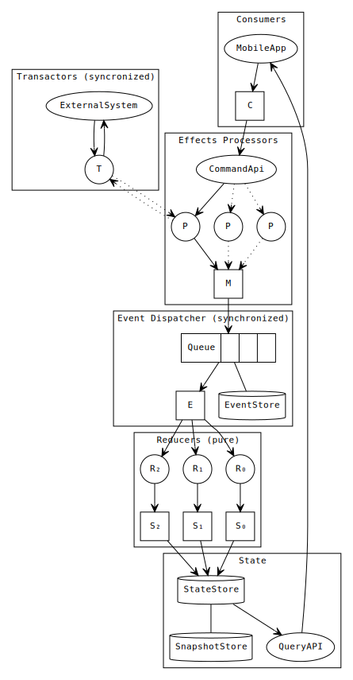

# Minimal Event Sourcing Components

## Prerequisites

- Redis
- MongoDB

## Development

Install dependencies and transpile by running `npm i`.

To get feedback while developing easiest is to run `npm run test:dev` to auto run
the type checks and tests.

## Project directory structure

- `src`: Source code with Flow type annotations
  - `es`: Event sourcing framework code
  - `drivers`: Drivers for event sourcing such as MongoDB backend support
  - `config`: Boilerplate code that injects customer logic, drivers and config
     and starts the system
  - `test`: Unit tests
- `lib`: *DON'T TOUCH* transpiled code from source
- `nix`: Nix build expressions for deterministic builds

## Overview

